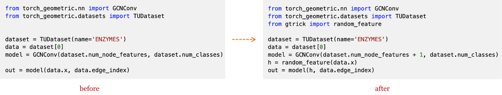

# gtrick: Bag of Tricks for Graph Neural Networks.

    

gtrick is an easy-to-use Python package that collects tricks for graph neural networks. It tests and provides powerful tricks to boost your models' performance.

Trick is all you need! ([English Document](https://sangyx.com/gtrick/) | [中文介绍](https://zhuanlan.zhihu.com/p/508876898))

## Library Highlights
* **Easy-to-use**: All it takes is to add a few lines of code to apply a powerful trick, with as few changes to existing code as possible.
* **Verified Trick**: All tricks implemented in gtrick are tested on our selected datasets. Only the tricks indeed improving a model's performance can be collected by gtrick.
* **Backend Free**: We provide all tricks both in [DGL](https://www.dgl.ai/) and [PyG](https://www.pyg.org/). Whatever graph learning library you use, feel free to try it.

## Installation

*Note: This is a developmental release.*

```bash
pip install gtrick
```

## Quick Start
It is very easy to get started with gtrick. You can enhance your GNN model with only a few lines of code.



For more detailed examples, see Example in [Trick](#trick).

## Trick

|     Trick    | Example | Task | Reference |
|:------------:|:------------:|:------------:|:-----:|
| VirtualNode |  [DGL](https://nbviewer.org/github/sangyx/gtrick/blob/main/benchmark/dgl/VirtualNode.ipynb)<br>[PyG](https://nbviewer.org/github/sangyx/gtrick/blob/main/benchmark/pyg/VirtualNode.ipynb) | graph | [OGB Graph Property Prediction Examples](https://github.com/snap-stanford/ogb/tree/master/examples/graphproppred/mol) |
| FLAG |  [DGL](https://nbviewer.org/github/sangyx/gtrick/blob/main/benchmark/dgl/FLAG.ipynb)<br>[PyG](https://nbviewer.org/github/sangyx/gtrick/blob/main/benchmark/pyg/FLAG.ipynb) | node*<br>graph | [Robust Optimization as Data Augmentation for Large-scale Graphs](https://arxiv.org/abs/2010.09891) |
| Fingerprint |  [DGL](https://nbviewer.org/github/sangyx/gtrick/blob/main/benchmark/dgl/Fingerprint.ipynb)<br>[PyG](https://nbviewer.org/github/sangyx/gtrick/blob/main/benchmark/pyg/Fingerprint.ipynb) | molecular graph* | [Extended-Connectivity Fingerprints](https://pubs.acs.org/doi/10.1021/ci100050t) |
| Random Feature |  [DGL](https://nbviewer.org/github/sangyx/gtrick/blob/main/benchmark/dgl/RandomFeature.ipynb)<br>[PyG](https://nbviewer.org/github/sangyx/gtrick/blob/main/benchmark/pyg/RandomFeature.ipynb) | graph* | [Random Features Strengthen Graph Neural Networks](http://arxiv.org/abs/2002.03155) |
| Label Propagation |  [DGL](https://nbviewer.org/github/sangyx/gtrick/blob/main/benchmark/dgl/LabelProp.ipynb)<br>[PyG](https://nbviewer.org/github/sangyx/gtrick/blob/main/benchmark/pyg/LabelProp.ipynb) | node* | [Learning from Labeled and Unlabeled Data with Label Propagation](http://mlg.eng.cam.ac.uk/zoubin/papers/CMU-CALD-02-107.pdf) |
| Correct & Smooth |  [DGL](https://nbviewer.org/github/sangyx/gtrick/blob/main/benchmark/dgl/C&S.ipynb)<br>[PyG](https://nbviewer.org/github/sangyx/gtrick/blob/main/benchmark/pyg/C&S.ipynb) | node* | [Combining Label Propagation And Simple Models Out-performs Graph Neural Networks](https://arxiv.org/abs/2010.13993) |
| Common Neighbors |  [DGL](https://nbviewer.org/github/sangyx/gtrick/blob/main/benchmark/dgl/EdgeFeat.ipynb)<br>[PyG](https://nbviewer.org/github/sangyx/gtrick/blob/main/benchmark/pyg/EdgeFeat.ipynb) | link* | [Link Prediction with Structural Information](https://github.com/lustoo/OGB_link_prediction/blob/main/Link%20prediction%20with%20structural%20information.pdf) |
| Resource Allocation |  [DGL](https://nbviewer.org/github/sangyx/gtrick/blob/main/benchmark/dgl/EdgeFeat.ipynb)<br>[PyG](https://nbviewer.org/github/sangyx/gtrick/blob/main/benchmark/pyg/EdgeFeat.ipynb) | link* | [Link Prediction with Structural Information](https://github.com/lustoo/OGB_link_prediction/blob/main/Link%20prediction%20with%20structural%20information.pdf) |
| Adamic Adar |  [DGL](https://nbviewer.org/github/sangyx/gtrick/blob/main/benchmark/dgl/EdgeFeat.ipynb)<br>[PyG](https://nbviewer.org/github/sangyx/gtrick/blob/main/benchmark/pyg/EdgeFeat.ipynb) | link* | [Link Prediction with Structural Information](https://github.com/lustoo/OGB_link_prediction/blob/main/Link%20prediction%20with%20structural%20information.pdf) |
| Anchor Distance |  [DGL](https://nbviewer.org/github/sangyx/gtrick/blob/main/benchmark/dgl/EdgeFeat.ipynb)<br>[PyG](https://nbviewer.org/github/sangyx/gtrick/blob/main/benchmark/pyg/EdgeFeat.ipynb) | link* | [Link Prediction with Structural Information](https://github.com/lustoo/OGB_link_prediction/blob/main/Link%20prediction%20with%20structural%20information.pdf) |

We have tested all these tricks on selected datasets, you can find the benchmark in [PyG Benchmark](benchmark/pyg/README.md) and [DGL Benchmark](benchmark/dgl/README.md).

*For the ogbg-molhiv GIN, please refer to [@willy-b](https://github.com/willy-b)'s [code](https://colab.research.google.com/drive/1MluOH3pOafwGdt9TKMqOBLfvLyeeDMX1?usp=sharing).*

## Contributing
Please let me know if you encounter a bug or have any suggestions by [filing an issue](https://github.com/sangyx/gtrick/issues).

All contributions for bug fixes, new tricks, and better examples are welcome. 

There are also some tricks I'm planning to add, feel free to implement one of them for gtrick:

- [ ] [SCR](https://github.com/THUDM/SCR)
- [ ] [GSAT](https://github.com/Graph-COM/GSAT)
- [ ] [Edge Proposal Set](https://arxiv.org/pdf/2106.15810.pdf)
